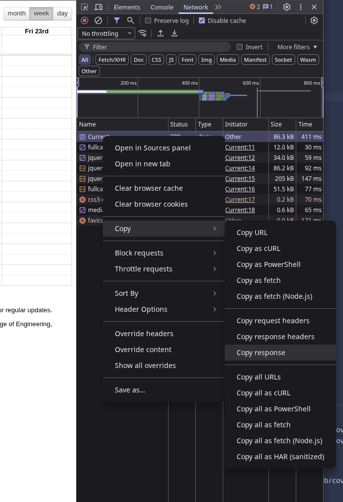
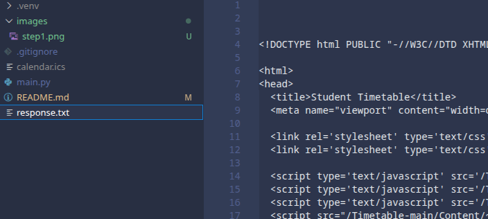

# cov-to-ics

Migrate the coventry university student timetable to an ics file

# Instructions

1. run `pip install -r requirements.txt`

2. if `calender.ics` exists already, rename it to `old_calender.ics`. This will allow the new calender file to update events from the old calender, and remove deleted events.

3. log into the coventry university timetable website, go into inspect element, go to the network tab and copy the response from the first request (refresh if no requests are showing up)

4. paste the response data into a file in the root of the repo called `response.txt`

5. run `main.py`, and you'll hopefully see `calender.ics` get created in the root folder of the repo :)

6. Upload that ics file to any calender application, I imagine basically all of them allow you to upload an ics file (google calender and thunderbird do).